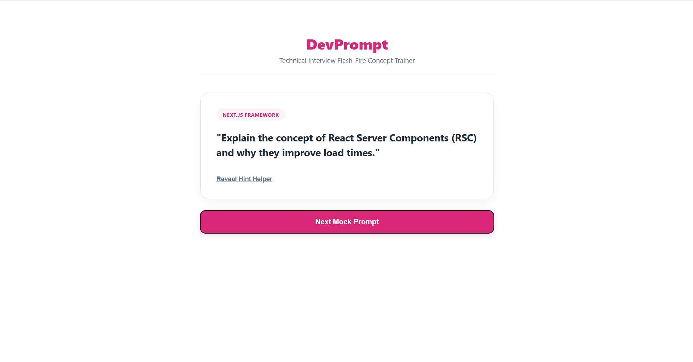

#  DevPrompt — Technical Interview Concept Generator

DevPrompt is a streamlined, server-optimized concept testing application built on Next.js. It delivers fast content switching, modular data segregation, and a clean interface designed to test core engineering architecture patterns.It's Actually a very useful tools for developers when we're preparing for technical interviews.

## devprompt-dashboard Preview

##  Architectural Blueprint Details
*  **Modular Data Mapping:** Isolates global technical concepts into clean internal server configurations.
*  **Controlled Dynamic State:** Leverages unified React state changes to render hidden elements conditionally on command.

##  Working Setup Instructions
1. Setup packages: `npm install`
2. Run local ecosystem: `npm run dev`